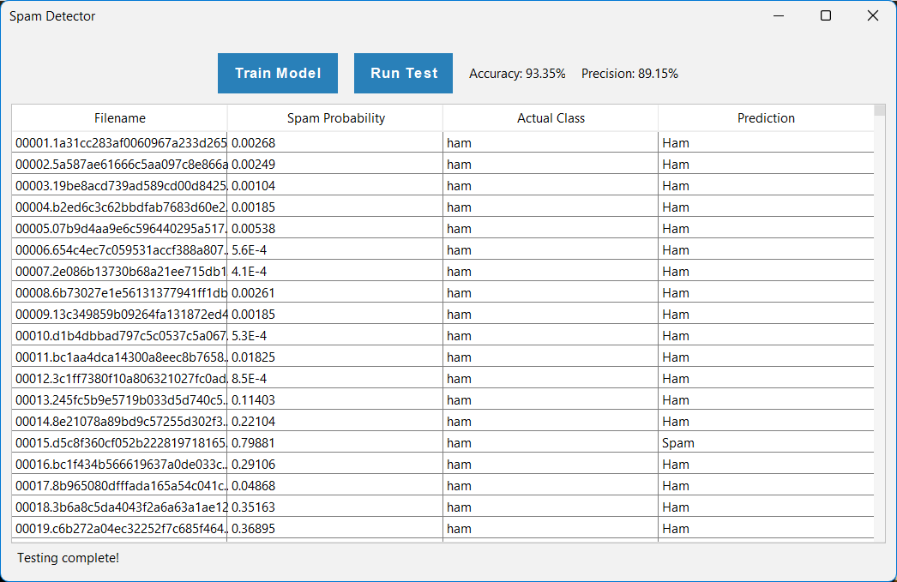
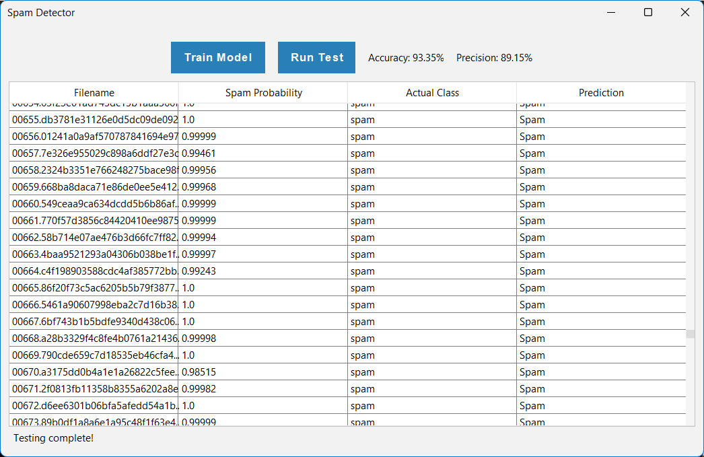

# Spam Email Detector 

This Java-based spam detection tool was developed by two students as part of a system integration project. It uses a Naive Bayes classifier based on unigram word probabilities to detect whether an email is spam or not.

## Features

- GUI built using Java Swing for ease of use
- Train and test folders for dataset management
- Real-time email classification with accuracy and precision stats
- Uses Laplace smoothing (0.8 factor) to avoid zero-probability issues
- Performance enhancements using square root scaling to balance precision and runtime

## How It Works

### 1. Training Phase

During training, the system processes all emails in `train/ham`, `train/ham2`, and `train/spam` folders. It constructs two frequency maps:

- `trainHamFreq`: Counts how many ham emails contain each word
- `trainSpamFreq`: Counts how many spam emails contain each word

From these frequencies, the following probabilities are computed:

#### Probability Calculations

For each word \( W_i \), we calculate:

- \( P(W_i | S) = \frac{\text{# of spam files containing } W_i}{\text{Total spam files}} \)
- \( P(W_i | H) = \frac{\text{# of ham files containing } W_i}{\text{Total ham files}} \)
- \( P(S | W_i) = \frac{P(W_i | S)}{P(W_i | S) + P(W_i | H)} \)

These values are stored in a `Map<String, Double>` for efficient lookup during testing.

### 2. Testing Phase

For each email in `test/ham` and `test/spam`, we calculate the spam probability based on words present in the email. The log-odds of spam are computed using:

\[
\eta = \sum_{i=1}^{N} \left[ \ln(1 - P(S | W_i)) - \ln(P(S | W_i)) \right]
\]

And the final spam probability for the email:

\[
P(S|F) = \frac{1}{1 + e^\eta}
\]

### 3. Evaluation Metrics

After classifying the test emails, we compute two key metrics:

- **Accuracy**:
  \[
  \text{accuracy} = \frac{\text{numCorrectGuesses}}{\text{numTotalGuesses}}
  \]

- **Precision**:
  \[
  \text{precision} = \frac{\text{numTruePositives}}{\text{numTruePositives} + \text{numFalsePositives}}
  \]

These are displayed in the UI along with a detailed table showing each file's predicted class, actual class, and calculated spam probability.

## How to Run

1. Clone this repository.
2. Ensure you have Java (JDK 17 or higher) installed.
3. Compile the code (starting with `SpamDetectorGUI.java`).
4. Run the application and use the GUI to:
  - Train on the directory: `./src/main/resources/data/train` (includes `ham`, `ham2`, and `spam` folders).
  - Test on the directory: `./src/main/resources/data/test`.

*Ensure you only select the folder – don't open it inside the file chooser.*

## Screenshot

  
  

## Improvements

- Laplace smoothing was used to improve generalization and avoid overfitting.
- Logarithmic and exponential functions prevent underflow for large documents.
- GUI and logic were modularized for better readability and maintenance.

## References

- [Bag-of-words model](https://en.wikipedia.org/wiki/Bag-of-words_model)
- [Naive Bayes spam filtering](https://en.wikipedia.org/wiki/Naive_Bayes_spam_filtering)
